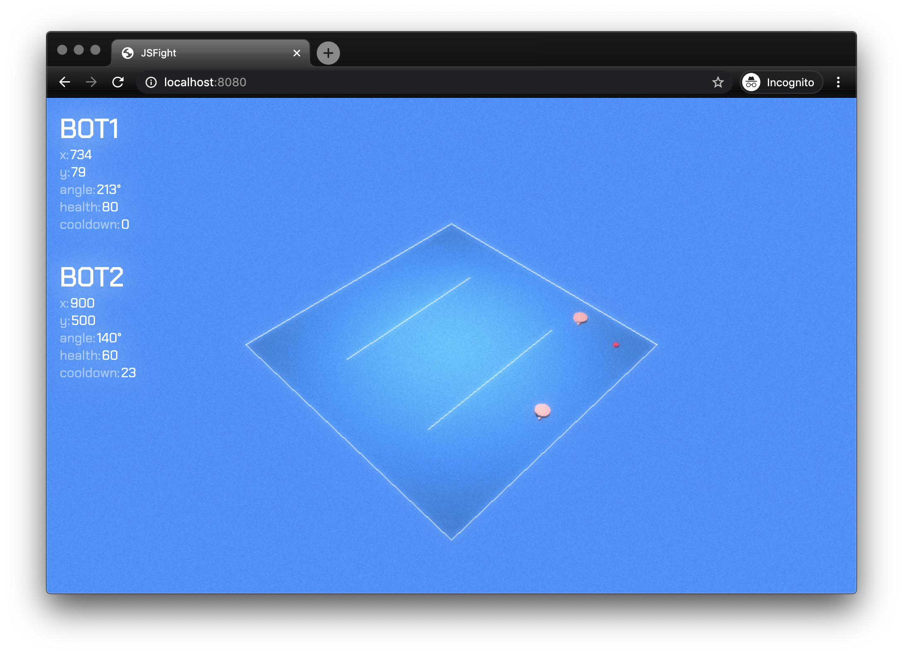

# JSFight

JSFight is a robot programming game written in Typescript.

# Setting up the project

-   Clone this repo
-   Run `npm install`
-   Run `npm start`
-   Open the game: `http://localhost:8080/`

# Creating your robot

Robots are very simple. All you need to is to create a file name `src/robots/Robot01.ts` and write a class that implements `IRobot` interface. Your robot should implement two methods:

-   _getName(): string_ which returns the name of your robot
-   _tick(state: IGameState): IRobotOutput_ is executed on each game tick. It takes a game state as an argument and returns enabled controls

## Game state

Game state is an object containing information about obstacles, enemies and power-ups. It contains three lists: robots, obstacles and power-ups.

-   Robots is a list of robots in the game. Robots has attributes like location and angle. See interface `IRobotState` for more details.
-   Obstacles is a list of obstacles. Obstacles are always lines with start and end coordinates. See interface `IObstacle` for more details.
-   Power-ups is a list of powerups. Currently game supports only health-powerup, which restores robots health back to original. See interface `IPowerUp` for more details.

## Robot output

You can imagine robot output as a game controller. It has a bunch of buttons and your robot needs to tell which buttons are pressed down. Output needs to implement `IRobotOutput` which has the following boolean flags:

-   accelerate
-   reverse
-   left
-   right
-   gunShoot

## Game arena and dimensions

## Manual robot

Current Robot01 is manually controllable with wasd + space. It's handy for testing.

## Example robot

Robot02 is a dead simple example of an automatic robot.
